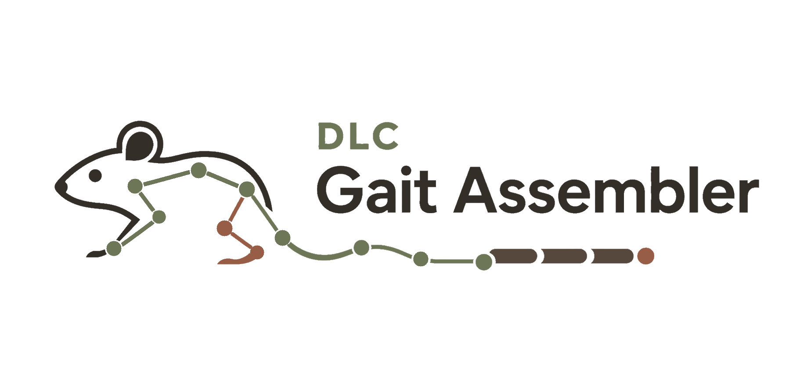

# DLC Gait Assembler

<p align="center">
  <picture>
    <source media="(prefers-color-scheme: dark)" srcset="assets/images/DLC-Gait-Assembler-logo-dark-original-clean.png">
    <source media="(prefers-color-scheme: light)" srcset="assets/images/DLC-Gait-Assembler-logo-light-original-clean.png">
    
  </picture>
</p>

A desktop application for preparing videos, processing DeepLabCut coordinates, and producing gait measurements.

## Setups

- **Runway** — use an automated profile or move through the manual pipeline:
  Calibration → Video Processing → DeepLabCut → Knee Correction → Gait Analysis → PCA/Random Forest.
- **Ladder** — detect and review ladder-rung paw placements, slips, and falls.

## Install

From the repository root:

```bash
conda env create -f GAIT_ASSEMBLER.yaml
conda activate gait-assembler
python -m pip install -e .
```

## Launch

```bash
conda activate gait-assembler
dlc-gait-assembler
```

## Runway workflows

### Automated

1. Configure or select a reusable profile.
2. Add videos.
3. Review the settings and run the pipeline.
4. Check progress and generated results in the application.

### Manual

Open the stages individually from the Manual Pipeline menu. Each stage saves output for the next stage.

For Gait Analysis:

1. Choose `ALMA + post-ALMA features` or the separate `RustLab1 standalone (three-view)` workflow.
2. For ALMA, choose single-side or multi-side input.
3. Add the required coordinate CSV files.
4. Confirm pairing, body-part labels, calibration, direction, and filters.
5. Select an output folder.
6. Generate and review the stick-plot preview.
7. Run the analysis and inspect the tables, figures, and run log.

For standalone RustLab1:

1. Add a matched left-side, right-side, and bottom-view coordinate CSV set.
2. Match the three views' body-part labels and choose the bottom-view reference paw.
3. Review the likelihood, smoothing, stance-speed, and minimum-phase settings.
4. Generate and review the RustLab1 stride preview.
5. Run RustLab1 to write stride, parameter, summary, preview, and optional figure outputs. This path does not run ALMA gait-cycle analysis, custom SOP features, or synchronized stroke outputs.

Changing an analysis setting invalidates the existing preview. Generate a new preview before running again.

## Main outputs

Depending on the selected workflow, the app can generate:

- processed videos and DeepLabCut coordinate files;
- corrected knee coordinates;
- gait parameter tables, summaries, and SVG figures;
- synchronized multi-view session summaries;
- PCA, Random Forest, and repeated-measures outputs.

Generated files follow the layout documented in [outputs/README.md](outputs/README.md).

Detailed scientific definitions are available in [SOP.tex](SOP.tex).

The in-app parameter and figure documentation describes the generated measurements,
required markers, calculations, and real ALMA/RustLab1 preview provenance.
Runway analysis defaults to the established 132-feature Hindlimb output. Select
`Hindlimb + Forelimb` to add 46 RustLab1 forelimb/interlimb parameters (178 total)
and include forelimb content in the adapted RustLab1 figure bundle.
ALMA, RustLab1, custom, and synchronized outputs share one configured confidence,
interpolation, and Butterworth-filtering pass. Post-ALMA features retain ALMA's
exact stride start/end rows.

## Troubleshooting

- **Run Gait Analysis is disabled:** add valid inputs and an output folder, then generate a new stick-plot preview.
- **No stride is detected:** check body-part labels, walking direction, calibration, likelihood threshold, and stride filters.
- **Standalone RustLab1 finds fewer than two stance onsets:** check the selected bottom-view reference paw, its label mapping, the 0.95 likelihood default, and the 7 px/frame stance-speed default.
- **Multi-view parameters are missing:** confirm the left, right, and bottom CSV pairing and label mappings.
- **PCA or Random Forest cannot run:** check that the session-summary files contain enough animals, groups, and usable features. The run log shows the exact requirement.

## Development

```bash
conda activate gait-assembler
python -m pip install -e ".[dev]"
pytest -q
ruff check src tests
```

Runtime configuration and imported analysis code live in `imports/`. The main environment is defined by `GAIT_ASSEMBLER.yaml`.
