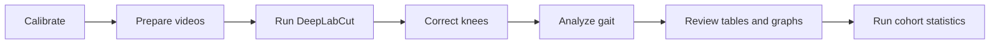

# DLC Gait Assembler

<p align="center">
  <picture>
    <source media="(prefers-color-scheme: dark)" srcset="assets/images/DLC-Gait-Assembler-logo-dark-original-clean.png">
    <source media="(prefers-color-scheme: light)" srcset="assets/images/DLC-Gait-Assembler-logo-light-original-clean.png">
    
  </picture>
</p>

<p align="center">
  <strong>A desktop workflow for preparing videos, processing DeepLabCut coordinates, and turning pose-estimation recordings into reviewable gait measurements.</strong>
</p>

<p align="center">
  <code>Video preparation</code> · <code>DeepLabCut</code> · <code>Knee correction</code> · <code>ALMA gait analysis</code> · <code>PCA</code> · <code>Random forest</code>
</p>

> [!NOTE]
> The application supports both a guided automated pipeline and individual manual tools. Gait Analysis and PCA stay inside the main application—no separate workspace windows are opened.

## At a glance

| Area | Purpose | Typical input | Main result |
|---|---|---|---|
| Calibration | Establish the spatial scale | Calibration video or image | Pixel-to-centimetre conversion map |
| Video Processing | Crop, trim, flip, enhance, and export videos | Experiment videos | Analysis-ready H.264 videos |
| DeepLabCut | Train, evaluate, and run pose estimation | Videos and a DLC project | Coordinate CSV/H5 files |
| Knee Correction | Correct inferred knee positions | Paired DLC CSV/H5 data | Corrected coordinate files |
| Gait Analysis | Detect gait cycles and calculate kinematics | Side-view or paired multi-view DLC CSVs | Parameter tables, summaries, and SVG figures |
| PCA + Random Forest | Analyze animal-session cohorts | `*_session_summary.csv` files | PCA, grouped classification, and mixed-effects outputs |

## Workflow



The manual toolbar follows this order. The automated pipeline applies the same stages from a saved profile and provides one place to review inputs, settings, and run progress.

## Quick start

### 1. Create the environment

From the repository root:

```bash
conda env create -f GAIT_ASSEMBLER.yaml
conda activate gait-assembler
python -m pip install -e .
```

### 2. Launch the application

After the editable installation, the command works from any directory while the environment is active:

```bash
conda activate gait-assembler
dlc-gait-assembler
```

If installing while your terminal is outside the repository, provide its path:

```bash
python -m pip install -e /path/to/dlc-gait-assembler
```

### 3. Choose how to work

- **Automated** — select a saved profile, add source videos, review the assembled pipeline, and run it end to end.
- **Manual** — open one stage at a time from Calibration through PCA + Random Forest.

## Gait Analysis

Gait Analysis opens directly to the embedded **Runway analysis** workspace. The screen is divided into a scrollable settings column and a larger working area.

### Workspace map

| Location | What it contains |
|---|---|
| Left-side setting tabs | Setup, calibration, analysis, filters, body-part mapping, and output options |
| Fixed action footer | Export manifest, generate the required stick-plot preview, and run the analysis |
| **1. Inputs** | CSV selection, automatic or manual view pairing, label matching, and output folder |
| **2. Preview / results** | Stick-plot review followed by selectable SVG and CSV output previews |
| **3. Run log** | Processing messages, warnings, skipped parameters, and generated file paths |

The workspace moves to the relevant view automatically: preview generation opens **Preview / results**, an active analysis opens **Run log**, and successful completion returns to **Preview / results**.

### Input modes

#### Multi side view

Use a matched set of:

- left side-view coordinate CSV;
- right side-view coordinate CSV; and
- bottom-view coordinate CSV.

The app groups filenames automatically when possible. Use **Edit CSV pairing** when filenames do not follow a consistent pattern, then use **Label body parts** to map each camera's DLC labels to the expected anatomical points.

#### Single side view

Use one side-view DLC coordinate CSV for the standard ALMA workflow. Confirm the body-part mapping, walking direction, and calibration before generating a preview.

### Recommended run sequence

1. Add the coordinate CSVs in **1. Inputs**.
2. Confirm pairing and body-part labels.
3. Set the analysis type, frame rate, calibration, direction, and filters in the left-side tabs.
4. Choose an output folder and select the desired output bundles.
5. Click **1. Generate stick-plot preview**.
6. Review the detected stride in **2. Preview / results**.
7. Click **2. Run gait analysis**.
8. Inspect generated graphs and tables in the embedded result selector; use **3. Run log** for warnings and file paths.

> [!IMPORTANT]
> Full gait analysis remains disabled until a valid stick-plot preview has been generated for the current inputs and settings. Changing a setting invalidates the old preview so the final run cannot silently use stale configuration.

## Gait output guide

### Core ALMA outputs

| Output | Contents |
|---|---|
| `*_parameters.csv` | Standard ALMA gait-cycle parameter table |
| `*_coordinates.csv` | Processed coordinates used by the analysis, when available |
| `*_parameters_long.csv` | Tidy one-parameter-per-row representation for plotting or statistics |
| `*_parameter_summary.csv` | Count, mean, standard deviation, quartiles, range, and coefficient of variation |
| `*_stickplot.svg` | Continuous-stride stick plot |
| `*_alma_figures/` | Eight diagnostic SVG figures described below |

The ALMA diagnostic bundle contains:

| Figure | Representation |
|---:|---|
| 1 | Cycle timing |
| 2 | Spatiotemporal profile |
| 3 | Joint kinematics |
| 4 | Cycle-by-cycle trends |
| 5 | Standardized parameter heatmap |
| 6 | Parameter correlation matrix |
| 7 | Variability profile |
| 8 | Toe-drag profile |

These tables and figures are enabled by default from the **Output** settings tab.

### RustLab1 and custom SOP outputs

When the multi-view data contains the required side- and bottom-view markers, the application also calculates the selected RustLab1 measures and the custom parameters defined in [SOP.tex](SOP.tex).

| Output | Contents |
|---|---|
| `*_rustlab1_parameters.csv` | 30 RustLab1 hindlimb parameters evaluated on ALMA gait-cycle boundaries |
| `*_custom_parameters.csv` | 14 custom SOP parameters, including coordination and bilateral MTP/knee height measures |
| `*_expanded_parameters.csv` | ALMA, RustLab1, and custom parameters combined by gait cycle |
| `*_rustlab1_figures/` | 18 adapted RustLab1 runway figure categories |

The run log reports how many parameters and figures were produced and identifies missing markers when a measure cannot be calculated. The complete RustLab1 bundle can be disabled from the **Output** settings tab.

### Synchronized multi-view stroke outputs

When synchronized stroke analysis is enabled and bottom-view calibration is available, each recording can also produce:

| Output | Purpose |
|---|---|
| `*_canonical_cycles.csv` | Canonical synchronized cycle boundaries and validity flags |
| `*_stride_features.csv` | Per-cycle ALMA, RustLab1, and custom features |
| `*_session_summary.csv` | Animal-session summary used by the cohort-analysis workspace |
| `*_primary_stroke_panel.csv` | Reduced primary outcome panel |
| `*_feature_dictionary.csv` | Machine-readable description of generated features |
| `*_qc_report.json` | Calibration, view assignment, tracking coverage, and rejection details |

## PCA, Random Forest, and repeated measures

Open **PCA + random forest** from the manual toolbar. The embedded workspace keeps cohort inputs and analysis choices on the left while reserving the larger right pane for status messages and generated paths.

### Input

Add synchronized `*_session_summary.csv` files from multiple animals and sessions. Metadata such as `animal_id`, `group`, `timepoint`, and `session_id` is carried into the statistical outputs.

### Available analyses

| Analysis | Safeguard | Key outputs |
|---|---|---|
| PCA | Median imputation and standardized features | `PCA_scores.csv`, `PCA_loadings.csv`, explained variance, cluster SVG, and scree SVG |
| Grouped Random Forest | Animals remain grouped during cross-validation | Predictions, permutation importance, and confusion-matrix SVG |
| Mixed-effects models | Animal-level repeated measurements | Primary-outcome estimates, planned contrasts, and failure report |

A feature-redundancy audit is written before the optional analyses. The run log reports retained features, model completion, accuracy, and any insufficient-data conditions.

## Imported runtimes and configuration

| Path | Purpose |
|---|---|
| `imports/alma/` | ALMA runtime scripts and default gait-analysis configuration |
| `imports/DEEPLABCUT.yaml` | Conda environment specification used by the DeepLabCut installation workflow |
| `GAIT_ASSEMBLER.yaml` | Main application environment |
| `SOP.tex` | Detailed scientific workflow and gait-parameter definitions |

## Troubleshooting

<details>
<summary><strong>The Run gait analysis button is disabled</strong></summary>

Confirm that the required CSVs and output folder are present, then generate a new stick-plot preview. Any change to preview-sensitive settings requires the preview to be regenerated.

</details>

<details>
<summary><strong>No valid stride is detected</strong></summary>

Check body-part labels, walking direction, pixel calibration, likelihood threshold, and stride height/length filters. Try automatic direction detection or relax overly strict thresholds.

</details>

<details>
<summary><strong>RustLab1 or custom parameters are missing</strong></summary>

Open **Label body parts** and confirm that the required left-, right-, and bottom-view markers are mapped. The run log lists the missing markers and the subset of parameters that could be calculated.

</details>

<details>
<summary><strong>PCA or Random Forest cannot run</strong></summary>

PCA needs at least two animal-session rows and one usable feature. Grouped Random Forest needs at least two experimental groups and at least two animals per group. Review the activity pane for the exact data requirement that was not met.

</details>

## Development checks

Run the unit tests and lint checks inside the application environment:

```bash
conda activate gait-assembler
python -m pip install -e ".[dev]"
pytest -q
ruff check src tests
```

## Legacy ladder analysis

Ladder-rung analysis remains available in the codebase but is not exposed as a primary application stage. Its reviewed footfall exports retain the original ALMA event columns: `time`, `depth`, `start`, `end`, `duration`, `bodypart`, and `slip or fall`.
